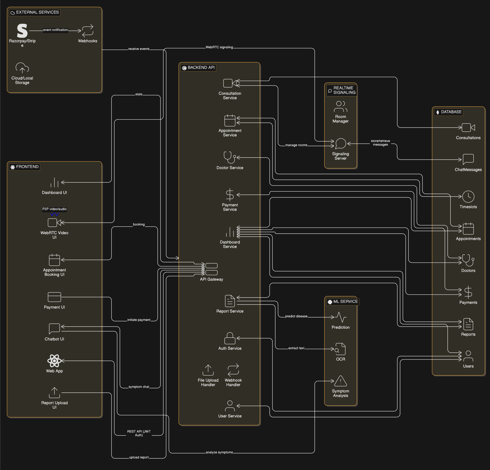
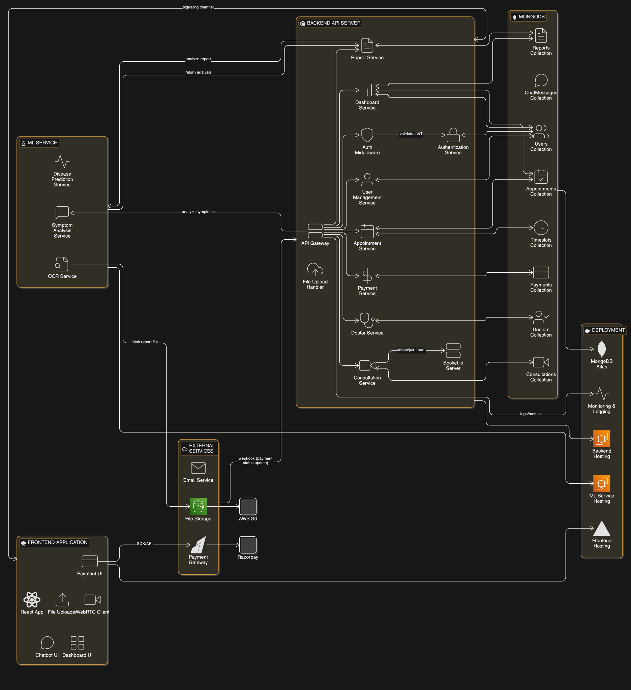

# ✅ HealthVision — MVP Description (Refined & Professional)

HealthVision is a MedTech web application built using the MERN stack (MongoDB, Express.js, React, Node.js) with integrated AI/ML capabilities.

The project uses Git-based branching workflows for feature development and version control.

## 🎯 MVP Goal

Provide users a simple, accessible digital health platform where they can analyze medical reports, book appointments, and consult doctors, all through a unified and secure dashboard.

## 🌟 MVP Features

### 1. User Authentication

- Secure login & signup flow using JWT + bcrypt
- Access to dashboard and all personalized features only when logged in

### 2. Public Section (No Login Required)

- Browse list of doctors with basic details
- View patient feedback & ratings

### 3. User Dashboard

A personalized dashboard containing:

- Quick navigation tiles for key actions
- Simple charts representing user activity (appointments history, consultations, etc.)

## ⚙️ Core Functionalities (MVP)

### A. Report Analysis (AI/ML)

- Upload a medical report (PDF/Image)
- Extract text using OCR
- Pass extracted data to lightweight ML models for basic disease pattern detection such as dengue, typhoid, viral fever
- Show simple result summary (not full diagnostic)
- **Symptom Chatbot:** Users can describe symptoms in a chatbot interface, which will analyze the input and suggest the urgency level for consulting a doctor (e.g., immediate, within 24 hours, routine consultation)

### B. Consult a Doctor (WebRTC — MVP version)

- Allow user to initiate voice/video consultation with doctor
- Basic real-time connection using WebRTC (no call recording, no complex room system yet)

### C. Appointment Booking

Users can:

- Select doctor
- Pick timeslot
- Confirm appointment

### D. Payment Integration (Basic)

- Allow user to pay 20% of consultation fee during booking
- Use a test-mode gateway (Razorpay/Stripe) for MVP

## 📦 Tech Stack

- **Frontend:** React.js
- **Backend:** Node.js + Express.js
- **Database:** MongoDB
- **AI/ML:** OCR + basic disease-prediction models (Python model served through API)
- **WebRTC:** For real-time communication
- **Version Control:** Git with feature-branch workflow

## 🔧 Development Approach

- Each feature (auth, report analysis, symptom chatbot, appointment, payment, WebRTC, dashboard) developed in a dedicated branch
- Merged into main via pull requests after testing

## 🔌 Technical Communication Process

The HealthVision ecosystem relies on a 3-tier communication architecture between the Frontend, Backend, and AI/ML services:

### 🔄 Request Flow & Interaction

1.  **Frontend (React) to Backend (Node.js):**
    *   React sends HTTP requests (via Axios) to the Node.js REST API.
    *   Handles user actions like uploading report files (multipart/form-data) or fetching dashboard data.
    *   Secured via JWT tokens passed in the Authorization header.

2.  **Backend (Node.js) to AI/ML Service (Python/FastAPI):**
    *   Node.js acts as an Orchestrator. When a report is uploaded, Node.js forwards the file or the file path to the Python ML API.
    *   Communication happens over internal HTTP requests (Service-to-Service).
    *   The Python service performs OCR and inference, returning structured JSON data (predicted diseases, confidence levels) back to Node.js.

3.  **Data Persistence (MongoDB):**
    *   Node.js receives the ML results and persists them to MongoDB along with the user's report metadata.

4.  **Response Return:**
    *   Node.js sends the final structured response back to the React frontend to be displayed on the analysis results page.

### 📡 Real-time Communication (WebRTC)
*   **Signaling:** Node.js + Socket.io are used as a signaling server to exchange SDP (Session Description Protocol) and ICE candidates between two peers.
*   **Media Stream:** Once signaling is complete, the peer-to-peer connection is established directly between the users' browsers for low-latency video/audio streaming.

## 📐 System Design Diagrams

### High-Level Design (HLD)

### Low-Level Design (LLD)

